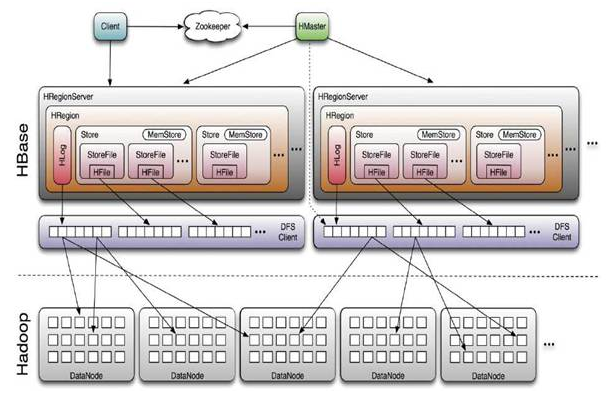

Hadoop 生态系统： 
Flume 
Sqoop 
Mahout 
Pig 
Hive 
Zookeeper 
MapReduce 
HBase 
HDFS 

HBase简介： 
是一个高可靠性、高性能、面向列、可伸缩、实时读写的分布式数据库。 
利用Hadoop HDFS作为其文件存储系统，利用Hadoop MapReduce来处理HBase中的海量数据，利用Zookeeper作为其分布式协同服务。
主要用来存储非结构化和半结构化的松散数据(列存NoSQL数据库)

HBase的数据模型： 
RowKey: 
决定一行数据。 
按照字典顺序排列。 
RowKey只能存储64k的字节数据。 

Column Family & qualifier: 
HBase表中的每一个列都归属于某个列族，列族必须作为表模式(schema)定义的一部分预先给出。 
列名以列族作为前缀，每个"列族"都可以有多个列成员(column)，新的列族成员可以随后按需、动态加入。 
权限控制、存储以及调优都是在列族层面进行的。 
HBase把同一列族里面的数据存储在同一个目录下，由几个文件保存。 

TimesStamp: 
在HBase每个Cell存储单元对同一份数据有多个副本，根据唯一的TimesStamp来区分每个版本之间的差异，不同版本的数据按照时间顺序排列，最新的数据版本排在最前面。 
TimesStamp的类型是64位整数。 
TimesStamp可以由HBase(在数据写入时自动)赋值，此时TimesStamp是精确到毫秒的当前系统时间。 
TimesStamp也可以由客户显式赋值，如果应用程序要避免数据版本冲突，就必须自己生成具有唯一性的TimesStamp。 

Cell单元格： 
由rowkey和family+qualifier（+TimesStamp）决定。 
Cell是有版本的。 
Cell的内容是未解析的字节数据。 
由{rowkey, column(=<family>+<qualifier>), version}唯一确定的单元。cell中数据没有数据类型，全部是采用字节码的形式存储。 

HLog： 
HLog文件就是一个普通的Hadoop Sequence File, Sequence File的Key是HLogKey对象，HLogKey中记录了写入数据的归属信息，除了table和region名字外，同时还包括sequence number和timestamp， timestamp是"写入时间"，sequence number的起始值为0，或者是最近一次存入文件系统中sequence number。 
HLog Sequence File的Value是HBase的Key Value对象，即对应HFile中的KeyValue。 

HBase体系架构： 
 
- client
  1. 包含访问HBase的接口并维护cache来加快对HBase的访问。
– Zookeeper
  1. 保证任何时候，集群中只有一个master
  2. 存贮所有Region的寻址入口。
  3. 实时监控Region server的上线和下线信息。并实时通知Master
  4. 存储HBase的schema和table元数据

– Master
  1. 为Region server分配region
  2. 负责Region server的负载均衡
  3. 发现失效的Region server并重新分配其上的region
  4. 管理用户对table的增删改操作

– RegionServer
  1. Region server维护region，处理对这些region的IO请求
  2. Region server负责切分在运行过程中变得过大的region

– Region
– HBase自动把表水平划分成多个区域(region)，每个region会保存一个表里面某段连续的数据；每个表一开始只有一个region，随着数据不断插入表，region不断增大，当增大到一个阀值的时候，region就会等分会两个新的region（裂变）；
– 当table中的行不断增多，就会有越来越多的region。这样一张完整的表被保存在多个Regionserver 上。

– Memstore与storefile
– 一个region由多个store组成，一个store对应一个CF（列族）
– store包括位于内存中的memstore和位于磁盘的storefile写操作先写入memstore，当memstore中的数据达到某个阈值，hregionserver会启动flashcache进程写入storefile，每次写入形成单独的一个storefile
– 当storefile文件的数量增长到一定阈值后，系统会进行合并（minor、major compaction），在合并过程中会进行版本合并和删除工作（majar），形成更大的storefile
– 当一个region所有storefile的大小和超过一定阈值后，会把当前的region分割为两个，并由hmaster分配到相应的regionserver服务器，实现负载均衡
– 客户端检索数据，先在memstore找，找不到再找storefile
– HRegion是HBase中分布式存储和负载均衡的最小单元。最小单元就表示不同的HRegion可以分布在不同的HRegion server上。
– HRegion由一个或者多个Store组成，每个store保存一个columns family。
– 每个Strore又由一个memStore和0至多个StoreFile组成。如图：StoreFile以HFile格式保存在HDFS上。